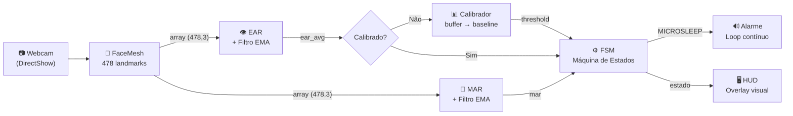
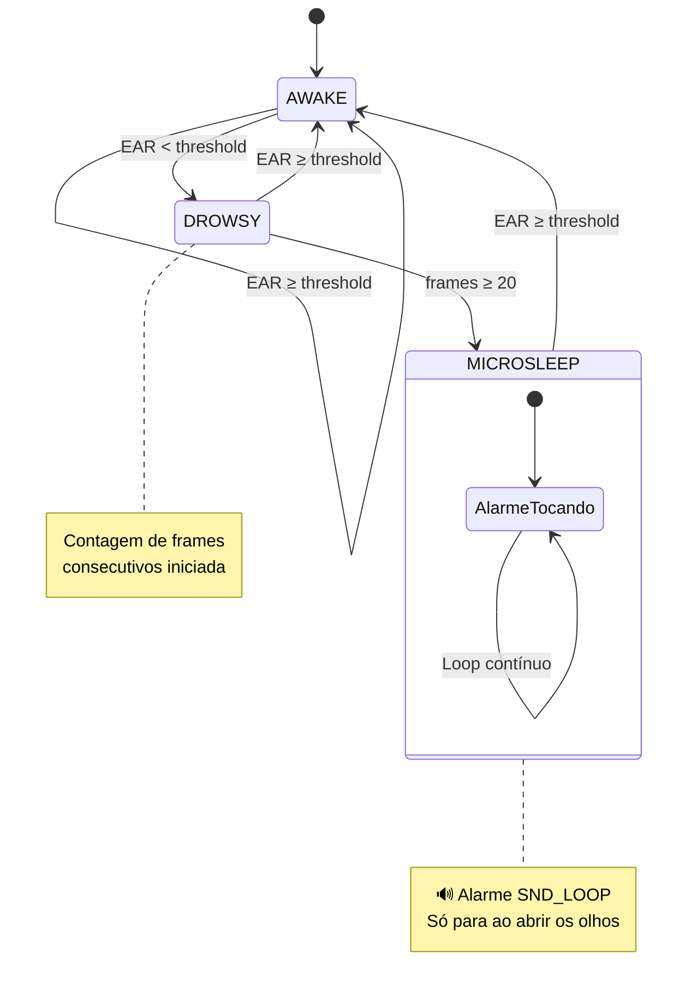

<div align="center">

# 🛡️ Sleep Guardian

### Sistema de Detecção de Fadiga Veicular em Tempo Real

[](https://python.org)
[](https://opencv.org)
[](https://mediapipe.dev)
[](https://numpy.org)
[](LICENSE)
[]()

*Sistema não intrusivo de monitoramento de fadiga por visão computacional, utilizando análise topológica de landmarks faciais para detectar microssono e prevenir acidentes por sonolência ao volante.*
<br>
*Desenvolvido como projeto acadêmico para a **Universidade de Brasília (UnB)**.*

---

[Funcionalidades](#-funcionalidades) •
[Arquitetura](#-arquitetura) •
[Matemática](#-fundamentação-matemática) •
[Instalação](#-instalação) •
[Uso](#-uso) •
[Configuração](#-configuração)

</div>

---

## 🎥 Demonstração

<div align="center">
  <video src="https://github.com/KevenLucas01/SleepGuardian_PT-BR/raw/main/assets/SleepGuardian.mp4" width="100%" controls="controls" muted="muted"></video>
</div>

---
## 📋 Sobre

O **Sleep Guardian** é um protótipo de sistema ADAS (Advanced Driver Assistance System) que monitora o nível de alerta do motorista em tempo real usando uma webcam padrão. O sistema detecta dois indicadores primários de fadiga:

| Indicador | Métrica | Detecção |
|-----------|---------|----------|
| 🔴 **Microssono** | Eye Aspect Ratio (EAR) | Fechamento prolongado dos olhos |
| 🟠 **Bocejo** | Mouth Aspect Ratio (MAR) | Abertura excessiva da boca |

Quando um nível perigoso de sonolência é detectado, o sistema dispara um **alarme sonoro contínuo e repetitivo** que **só para quando o motorista abrir os olhos**.

---

## ✨ Funcionalidades

| Recurso | Descrição |
|---------|-----------|
| 🎯 **Rastreamento facial** | 478 landmarks via MediaPipe Face Mesh |
| 👁️ **EAR (Eye Aspect Ratio)** | Detecção de piscadas e microssono |
| 👄 **MAR (Mouth Aspect Ratio)** | Detecção de bocejos |
| 🧠 **Calibração dinâmica** | Baseline pessoal calculado nos primeiros 30 frames |
| 📊 **Filtro EMA** | Suavização do sinal contra ruído estocástico |
| 🚨 **Alarme contínuo** | Repete em loop até o motorista acordar |
| 📈 **HUD em tempo real** | Barras EAR/MAR, estado, FPS, contador de bocejos |
| ⚡ **Renderização otimizada** | Inferência a 30fps, contornos a 15fps |
| 🛡️ **Tolerância a falha** | Oclusão facial e desconexão de câmera |
| 🔧 **Arquitetura modular** | Separação limpa em packages |

---

## 🏗️ Arquitetura

### Diagrama de Fluxo



### Máquina de Estados Finitos



---

## 🧮 Fundamentação Matemática

### Eye Aspect Ratio (EAR)

Baseado em Soukupová & Čech (2016) — "*Real-Time Eye Blink Detection using Facial Landmarks*":

$$\text{EAR} = \frac{\|p_2 - p_6\| + \|p_3 - p_5\|}{2 \cdot \|p_1 - p_4\|}$$

Onde $p_1 \ldots p_6$ são os landmarks palpebrais do MediaPipe Face Mesh:

| Ponto | Olho Esquerdo | Olho Direito | Localização |
|:-----:|:-------------:|:------------:|-------------|
| $p_1$ | 33 | 263 | Canto externo |
| $p_2$ | 160 | 387 | Pálpebra superior (medial) |
| $p_3$ | 158 | 385 | Pálpebra superior (lateral) |
| $p_4$ | 133 | 362 | Canto interno |
| $p_5$ | 153 | 380 | Pálpebra inferior (lateral) |
| $p_6$ | 144 | 373 | Pálpebra inferior (medial) |

**Comportamento:**
- 👁️ Olho aberto: EAR ≈ 0.25 – 0.35
- 😑 Olho fechado: EAR < 0.20
- 🔴 Microssono: EAR < threshold por ≥ 20 frames (~0.67s a 30fps)

### Mouth Aspect Ratio (MAR)

$$\text{MAR} = \frac{\|p_2 - p_6\| + \|p_3 - p_5\|}{2 \cdot \|p_1 - p_4\|}$$

| Ponto | Índice | Localização |
|:-----:|:------:|-------------|
| $p_1$ | 61 | Canto esquerdo |
| $p_2$ | 13 | Lábio superior (centro) |
| $p_3$ | 312 | Lábio superior (direito) |
| $p_4$ | 291 | Canto direito |
| $p_5$ | 317 | Lábio inferior (direito) |
| $p_6$ | 14 | Lábio inferior (centro) |

**Comportamento:**
- 😐 Boca fechada: MAR ≈ 0.1 – 0.3
- 🥱 Bocejo: MAR > 0.75 por ≥ 15 frames

### Filtro EMA (Exponential Moving Average)

Suaviza micro-oscilações estocásticas do MediaPipe antes de alimentar a FSM:

$$S_t = \alpha \cdot X_t + (1 - \alpha) \cdot S_{t-1}$$

| Parâmetro | Valor | Efeito |
|-----------|-------|--------|
| $\alpha$ | 0.3 | Fator de suavização |
| $\tau$ | ~93ms (a 30fps) | Constante de tempo |
| Step response | ~3 frames | 63% da mudança |

### Calibração Dinâmica

O threshold EAR é personalizado para cada usuário:

$$\text{threshold}_{\text{EAR}} = \overline{\text{EAR}}_{\text{baseline}} \times 0.80$$

O baseline é calculado a partir dos primeiros 30 frames válidos com rejeição de outliers (EAR fora de [0.10, 0.50]).

---

## 🚀 Instalação

### Pré-requisitos

- Python 3.10 a 3.12 (Atenção: Versões 3.13+ não são suportadas pelo MediaPipe nativamente)
- Webcam USB ou integrada
- Windows 10/11 (para alerta via `winsound`) ou Linux/macOS (fallback via terminal bell)

### Passo a Passo

```bash
# 1. Clonar o repositório
git clone https://github.com/seuusuario/SleepGuardian.git
cd SleepGuardian

# 2. (Recomendado) Criar ambiente virtual
python -m venv venv
venv\Scripts\activate      # Windows
# source venv/bin/activate  # Linux/macOS

# 3. Instalar dependências
pip install -r requirements.txt

# 4. Executar
python main.py
```

### Dependências

| Pacote | Versão | Função |
|--------|--------|--------|
| `opencv-python` | ≥ 4.8.0 | Captura de vídeo e manipulação de matrizes |
| `mediapipe` | ≥ 0.10.0 | Extração de 478 landmarks faciais |
| `numpy` | ≥ 1.24.0 | Operações vetorizadas e distância Euclidiana |

---

## 💻 Uso

### Execução Básica

```bash
python main.py
```

### Fases de Operação

1. **Calibração** (primeiros ~1-2 segundos)
   - Overlay semi-transparente com barra de progresso
   - Mantenha os olhos abertos naturalmente
   - O sistema calcula seu baseline EAR pessoal

2. **Monitoramento** (contínuo)
   - HUD exibe EAR, MAR, estado, FPS, bocejos
   - Contornos dos olhos e boca desenhados no frame
   - Indicador de estado com código de cores

3. **Alerta** (quando microssono é detectado)
   - Borda vermelha pulsante ao redor do frame
   - Texto "ALERTA: MICROSSONO!" centralizado
   - Alarme sonoro contínuo (2500Hz, padrão staccato)
   - **O alarme SÓ PARA quando o motorista abrir os olhos**

### Controles

| Tecla | Ação |
|-------|------|
| `q` | Encerrar o programa |

---

## ⚙️ Configuração

Todos os parâmetros estão centralizados em [`config.py`](config.py):

### Thresholds

| Parâmetro | Default | Descrição |
|-----------|---------|-----------|
| `EAR_THRESHOLD_DEFAULT` | `0.20` | Fallback se calibração falhar |
| `EAR_CONSEC_FRAMES` | `20` | Frames para confirmar MICROSLEEP |
| `EAR_BASELINE_MULTIPLIER` | `0.80` | Fator sobre baseline para threshold dinâmico |
| `MAR_THRESHOLD` | `0.75` | Limiar para detecção de bocejo |
| `MAR_CONSEC_FRAMES` | `15` | Frames para confirmar bocejo |

### Calibração

| Parâmetro | Default | Descrição |
|-----------|---------|-----------|
| `CALIBRATION_FRAMES` | `30` | Frames para calcular baseline |
| `CALIBRATION_EAR_MIN` | `0.10` | EAR mínimo aceito (rejeita outliers) |
| `CALIBRATION_EAR_MAX` | `0.50` | EAR máximo aceito (rejeita outliers) |

### Filtro EMA

| Parâmetro | Default | Descrição |
|-----------|---------|-----------|
| `EMA_ALPHA` | `0.30` | Fator de suavização (↑ = menos suave, ↓ = mais suave) |

### Câmera e Performance

| Parâmetro | Default | Descrição |
|-----------|---------|-----------|
| `CAMERA_INDEX` | `0` | Índice da câmera |
| `FRAME_WIDTH` | `640` | Largura do frame |
| `FRAME_HEIGHT` | `480` | Altura do frame |
| `HUD_FRAME_SKIP` | `2` | Contornos desenhados a cada N frames |

### Tolerância a Falha

| Parâmetro | Default | Descrição |
|-----------|---------|-----------|
| `MAX_NO_FACE_FRAMES` | `10` | Frames sem face antes de resetar para AWAKE |
| `CAMERA_RECONNECT_DELAY` | `0.5s` | Delay de reconexão da câmera |

---

## 📁 Estrutura do Projeto

```
SleepGuardian/
│
├── 📄 config.py                  # Constantes, landmarks e parâmetros
├── 📄 main.py                    # Entry point — loop principal
├── 📄 requirements.txt           # Dependências Python
├── 📄 README.md                  # Este arquivo
│
├── 📁 assets/
│   └── 🔊 alert.wav              # Alarme sonoro (2500Hz staccato)
│
├── 📁 detector/                   # Aquisição e métricas biométricas
│   ├── __init__.py
│   ├── 📄 face_mesh.py           # Wrapper MediaPipe → array (478,3)
│   ├── 📄 ear.py                 # EAR vetorizado + filtro EMA
│   └── 📄 mar.py                 # MAR vetorizado + filtro EMA
│
├── 📁 engine/                     # Lógica de negócio
│   ├── __init__.py
│   ├── 📄 calibration.py         # Calibração dinâmica do threshold
│   ├── 📄 state_machine.py       # FSM: AWAKE → DROWSY → MICROSLEEP
│   └── 📄 alert.py               # Alarme contínuo (winsound SND_LOOP)
│
└── 📁 utils/                      # Interface visual
    ├── __init__.py
    └── 📄 drawing.py             # HUD overlay com throttling
```

---

## 🔧 Como Funciona (Pipeline por Frame)

```
┌─────────────────────────────────────────────────────────────────┐
│                        LOOP PRINCIPAL                           │
├─────────────────────────────────────────────────────────────────┤
│                                                                 │
│  1. cv2.VideoCapture.read()          ← Captura BGR             │
│  2. cv2.flip(frame, 1)              ← Espelhamento             │
│  3. FaceMeshDetector.process()      ← 478 landmarks (x,y,z)   │
│  4. EARCalculator.compute()         ← EAR filtrado (EMA)      │
│  5. MARCalculator.compute()         ← MAR filtrado (EMA)      │
│  6. DynamicCalibrator.feed()        ← Baseline (30 frames)    │
│  7. FatigueStateMachine.update()    ← AWAKE/DROWSY/MICROSLEEP │
│  8. AlertSystem.trigger/stop()      ← Alarme SND_LOOP         │
│  9. draw_hud() / draw_calibration() ← Overlay visual          │
│ 10. cv2.imshow()                    ← Display                  │
│                                                                 │
└─────────────────────────────────────────────────────────────────┘
```

---

## 🐛 Edge Cases e Vetores de Falha

| Cenário | Impacto | Mitigação |
|---------|---------|-----------|
| Oclusão parcial (mão, óculos) | Landmarks distorcidos | Mantém último estado válido por 10 frames |
| Iluminação insuficiente | Detecção falha | `min_detection_confidence = 0.5` + EMA |
| Variação anatômica | Falso positivo | Calibração dinâmica (baseline pessoal) |
| Câmera desconectada | Crash | Reconexão automática com delay |
| Múltiplas faces | Processamento incorreto | `max_num_faces = 1` |
| Head pose rotation | EAR/MAR distorcidos | Coordenadas 3D do Face Mesh |

---

## 🗺️ Roadmap

- [ ] Detecção de rotação da cabeça (head pose estimation)
- [ ] Dashboard web com histórico de sessão
- [ ] Portabilidade para Android (ARM + câmera frontal)
- [ ] Integração com OBD-II (telemetria veicular)
- [ ] Modelo de ML para classificação multimodal de fadiga

---

## 🤝 Contribuindo

Contribuições são bem-vindas! Para contribuir:

1. Faça um fork do projeto
2. Crie uma branch para sua feature (`git checkout -b feature/nova-feature`)
3. Commit suas mudanças (`git commit -m 'feat: adiciona nova feature'`)
4. Push para a branch (`git push origin feature/nova-feature`)
5. Abra um Pull Request

---

## 📄 Licença

Este projeto está licenciado sob a licença MIT — veja o arquivo [LICENSE](LICENSE) para detalhes.

---

## 🙏 Agradecimentos

- [MediaPipe](https://mediapipe.dev/) — Google, pela biblioteca de face mesh
- [Soukupová & Čech (2016)](https://vision.fe.uni-lj.si/cvww2016/proceedings/papers/05.pdf) — Pela formulação do EAR
- [OpenCV](https://opencv.org/) — Pela infraestrutura de visão computacional
- [NumPy](https://numpy.org/) — Pela computação vetorizada

---

<div align="center">

**Feito com ☕ e visão computacional**

*Se este projeto ajudou você, considere dar uma ⭐*

</div>
